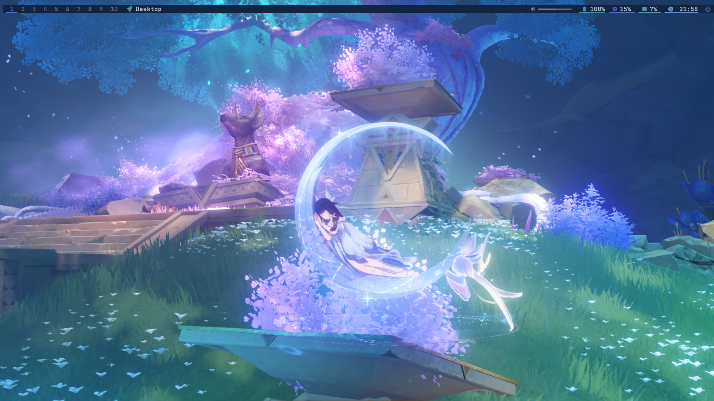
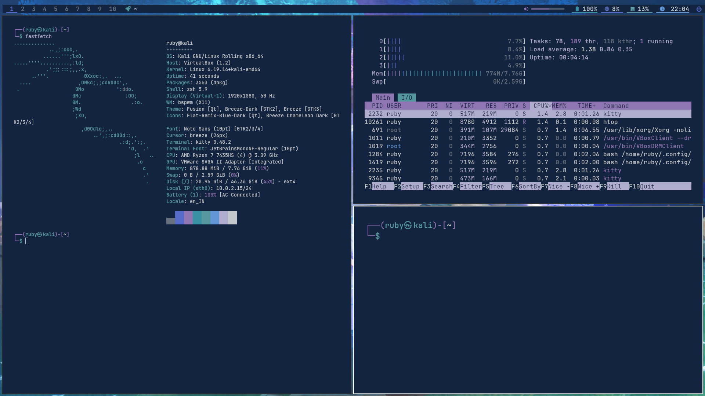
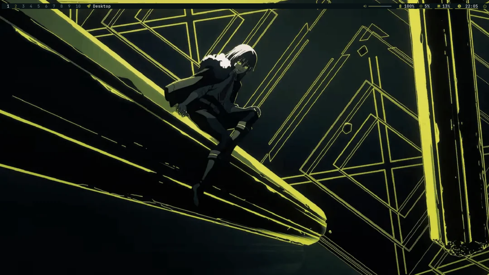
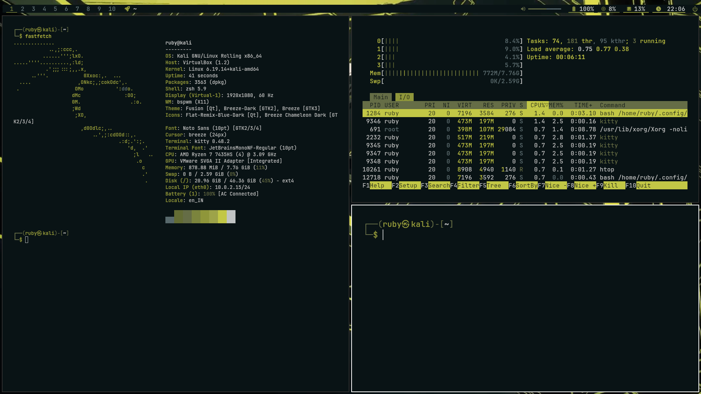
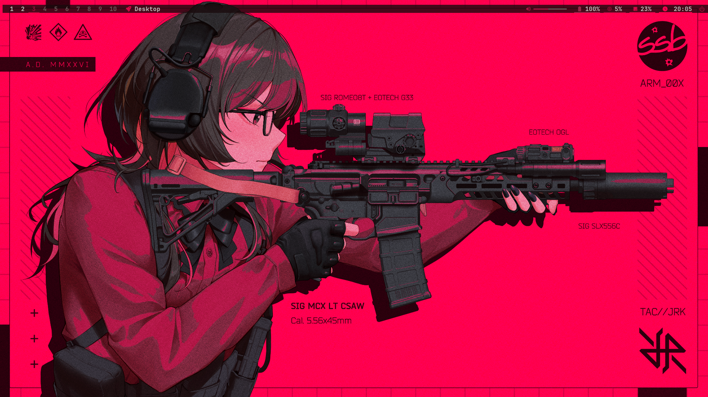
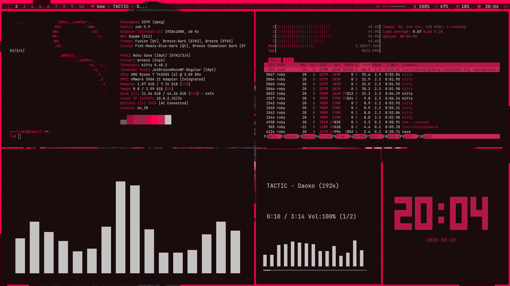

# My BSPWM Dotfiles

These are my personal configuration files (dotfiles) for my BSPWM setup. This is a clean, keyboard-driven tiling window environment styled dynamically (via Pywal16) using BSPWM, Polybar, Dunst, Rofi, and Kitty.

Everything is stored inside the `dotfiles` folder (once you are done cloning the repository as given in the command in the following sections) to keep things easy to manage, back up, and copy to new installations.

> [!WARNING]
> **Disclaimer & Usage Warning**
> Since these are my personal configuration files tailored to my own workflow and hardware, please keep the following in mind:
> - **Potential Bugs:** You may encounter bugs, broken scripts, or layout issues.
> - **Updates:** Not all local fixes, tweaks, or updates will be immediately pushed to GitHub. It should also be noted that this is not a `just run and everything's installed` script. Some features or apps mentioned or used may not be referenced in the dependencies installation commands/section.
> - **Self-Sufficiency Required:** By using these dotfiles, you agree that you are either test-driving them or possess the necessary troubleshooting skills to fix things on your own if something goes wrong, or if some packages or files are missing.
> - **System Discrepancies:** Configuration details like network interface names, monitor layouts, default wallpaper names, packages, etc., might need manual adjustments to work on your specific setup.
> - **No Warranty:** Use them at your own risk. Make sure to back up your existing configurations before applying these.


## Screenshots

<p align="center">
  
  
</p>
<p align="center">
  
  
</p>
<p align="center">
  
  
</p>


## What configs are Included

Here's the breakdown of my config directories and what each does in my setup:


| Component | Directory / File | Description |
| :--- | :--- | :--- |
| **BSPWM** | [`bspwm/`](bspwm/) | The window manager itself, containing workspace rules, startup services, and utility scripts. |
| **SXHKD** | [`sxhkd/`](sxhkd/) | Simple X Hotkey Daemon configs handling all window operations and keyboard shortcuts. |
| **Polybar** | [`polybar/`](polybar/) | Status bar configuration, with options for modular widgets (volume, workspaces, date, etc.). |
| **Rofi** | [`rofi/`](rofi/) | App launcher, clipboard history searcher, power menu, and screenshot interfaces. |
| **Dunst** | [`dunst/`](dunst/) | Lightweight and customizable notification daemon config. |
| **Kitty** | [`kitty/`](kitty/) | Fast, GPU-accelerated terminal emulator configured for standard use. |
| **Pywal16** | [`wal/`](wal/) | Color templates used to generate theme palettes dynamically based on your wallpapers. |
| **Picom** | [`picom.conf.arch`](picom.conf.arch) | Compositor configuration file for window fading, shadows, animations, and transparency. |
| **Greenclip** | [`greenclip.toml`](greenclip.toml) | Configuration for the Haskell-based clipboard manager daemon. |
| **Systemd** | [`systemd/`](systemd/) | Contains the user systemd service to autostart the `greenclip` daemon. |

---

## Dependencies I Use

Here are all the packages I have installed on my system to run this environment:

> [!IMPORTANT]
> **Use Pywal16 (`pywal16`), not legacy `pywal`:**
> The original `pywal` package by dylanaraps has been unmaintained for several years and causes silent crashes on newer Python runtimes (Python 3.10+). Furthermore, the templates in this setup (such as Polybar's `colors-polybar`) utilize template functions like `.darken()` and `.lighten()` that are only supported in [**`pywal16`**](https://github.com/eylles/pywal16).
> If you already have legacy `pywal` installed, uninstall it first (`sudo pacman -R python-pywal` or `pip uninstall pywal`). The CLI command remains identical (`wal -i /path/to/wallpaper.png`).

### 1. Installing on Different Linux Distros

#### **Arch Linux**
Using `pacman` and `yay` (or your preferred AUR helper):
```bash
# Install core packages from official repos
sudo pacman -S bspwm sxhkd polybar rofi dunst kitty feh imagemagick pamixer brightnessctl maim xclip xdotool jq libnotify ttf-jetbrains-mono-nerd yad autorandr xorg-xrandr pacman-contrib thunar falkon

# Install AUR packages (pywal16, greenclip, betterlockscreen, picom with animations)
yay -S python-pywal16 greenclip betterlockscreen picom-git

# Alternatively, if installing pywal16 via pip/pipx:
# pip install --break-system-packages pywal16  # OR: pipx install pywal16
```

#### **Debian / Ubuntu**
```bash
# Install core packages from APT
sudo apt update
sudo apt install bspwm sxhkd polybar rofi dunst kitty feh imagemagick pamixer brightnessctl maim xclip xdotool jq libnotify-bin fonts-jetbrains-mono python3-pip picom fonts-font-awesome fonts-firacode yad autorandr x11-xserver-utils thunar falkon

# Install Pywal16 via pip
pip3 install --user pywal16
# Note: On newer Debian/Ubuntu releases with PEP 668, use:
# pip3 install --user --break-system-packages pywal16  # OR: pipx install pywal16

# Download Greenclip binary from GitHub
wget https://github.com/erebe/greenclip/releases/download/v4.2/greenclip
chmod +x greenclip
sudo mv greenclip /usr/local/bin/

# Note: betterlockscreen must be built from source or installed manually on Debian/Ubuntu
# as it requires i3lock-color, which is not in the default APT repositories.
```

#### **Fedora**
```bash
# Install core packages from DNF
sudo dnf install bspwm sxhkd polybar rofi dunst kitty feh ImageMagick pamixer brightnessctl maim xclip xdotool jq libnotify jetbrains-mono-fonts picom yad autorandr xrandr thunar falkon

# Install Pywal16 via pip
pip install --user pywal16
# Note: On newer Fedora releases with PEP 668, use:
# pip install --user --break-system-packages pywal16  # OR: pipx install pywal16

# Download Greenclip binary from GitHub
wget https://github.com/erebe/greenclip/releases/download/v4.2/greenclip
chmod +x greenclip
sudo mv greenclip /usr/local/bin/
```

#### **OpenSUSE**
```bash
# Install core packages from Zypper
sudo zypper install bspwm sxhkd polybar rofi dunst kitty feh ImageMagick pamixer brightnessctl maim xclip xdotool jq libnotify-tools jetbrains-mono-fonts picom yad autorandr xrandr thunar falkon

# Install Pywal16 via pip
pip install --user pywal16
# Note: On newer openSUSE releases with PEP 668, use:
# pip install --user --break-system-packages pywal16  # OR: pipx install pywal16

# Download Greenclip binary from GitHub
wget https://github.com/erebe/greenclip/releases/download/v4.2/greenclip
chmod +x greenclip
sudo mv greenclip /usr/local/bin/
```

---

## How to Set It Up

Here are the steps to clone my repository and load these configurations on your own system:

### Step 1: Clone the repository
Clone the repository to a local directory:
```bash
git clone https://github.com/sahil-k-george/bspwm-dotfiles.git ~/dotfiles
```

### Step 2: Backup existing configurations (Safe Step)
If you already have configuration folders inside `~/.config/`, backup them up to prevent losing any local settings:
```bash
mkdir -p ~/.config/backup_dotfiles
for dir in bspwm sxhkd polybar rofi dunst kitty wal; do
    [ -d ~/.config/$dir ] && mv ~/.config/$dir ~/.config/backup_dotfiles/
done
[ -f ~/.config/greenclip.toml ] && mv ~/.config/greenclip.toml ~/.config/backup_dotfiles/
```

### Step 3: Link or Copy files
You can either symbolically link (highly recommended for keeping changes in sync with git) or copy the files directly.

#### **Option A: Deploy using Symbolic Links (Recommended)**
```bash
mkdir -p ~/.config

# Link directories
ln -sf ~/dotfiles/bspwm ~/.config/bspwm
ln -sf ~/dotfiles/sxhkd ~/.config/sxhkd
ln -sf ~/dotfiles/polybar ~/.config/polybar
ln -sf ~/dotfiles/rofi ~/.config/rofi
ln -sf ~/dotfiles/dunst ~/.config/dunst
ln -sf ~/dotfiles/kitty ~/.config/kitty
ln -sf ~/dotfiles/wal ~/.config/wal

# Copy wal to cache
mkdir -p ~/.cache
cp -r ~/dotfiles/wal ~/.cache/

# Link individual configuration files
ln -sf ~/dotfiles/greenclip.toml ~/.config/greenclip.toml
ln -sf ~/dotfiles/picom.conf.arch ~/.config/picom.conf
```

#### **Option B: Deploy by Copying Files**
```bash
mkdir -p ~/.config

# Copy directories
cp -r ~/dotfiles/bspwm ~/.config/
cp -r ~/dotfiles/sxhkd ~/.config/
cp -r ~/dotfiles/polybar ~/.config/
cp -r ~/dotfiles/rofi ~/.config/
cp -r ~/dotfiles/dunst ~/.config/
cp -r ~/dotfiles/kitty ~/.config/
cp -r ~/dotfiles/wal ~/.config/

# Copy wal to cache
mkdir -p ~/.cache
cp -r ~/dotfiles/wal ~/.cache/

# Copy individual files
cp ~/dotfiles/greenclip.toml ~/.config/greenclip.toml
cp ~/dotfiles/picom.conf.arch ~/.config/picom.conf
```

---

### Step 4: Configure and Enable Systemd Services

The Haskell clipboard manager `greenclip` requires its daemon to be running. We configure it as a user systemd service:

```bash
# Create directory for systemd user unit files
mkdir -p ~/.config/systemd/user/

# Link the user service file
ln -sf ~/dotfiles/systemd/user/greenclip.service ~/.config/systemd/user/greenclip.service

# Reload systemd configuration and enable/start greenclip service
systemctl --user daemon-reload
systemctl --user enable --now greenclip.service
```

---
## Before exiting the current WM
> Don't forget to add the entry for bspwm, otherwise you won't be able to access it.

```bash
sudo nano /usr/share/xsessions/bspwm.desktop
```
In the opened file, add this
```
[Desktop Entry]
Name=bspwm
Comment=Binary space partitioning window manager
Exec=bspwm
Type=Application
DesktopNames=bspwm
```

> [!WARNING]
>I might have missed some things that has to be done before exiting the current WM. If you encounter any issues of missing commands or points, do let me know.

---

## How to Update

When new updates or fixes are pushed, you can update your setup based on how you installed it:

### Option A: If you used Symbolic Links (Recommended)
Since your configuration files are linked directly to the repository, updating is seamless:
1. Navigate to your local dotfiles directory:
   ```bash
   cd ~/dotfiles
   ```
2. Pull the latest changes:
   ```bash
   git pull
   ```
3. Reload your hotkeys (`Super + Escape`) and BSPWM (`Super + Ctrl + R`) to apply the changes immediately.

### Option B: If you Copied the Files
Since the files were copied to `~/.config/`, you will need to pull the updates and copy them over again:
1. Navigate to your local dotfiles directory and pull the latest changes:
   ```bash
   cd ~/dotfiles && git pull
   ```
2. Copy the updated directories and files (overwriting the old ones):
   ```bash
   # Copy directories
   cp -r bspwm/ sxhkd/ polybar/ rofi/ dunst/ kitty/ wal/ ~/.config/

   # Copy wal to cache
   mkdir -p ~/.cache
   cp -r wal/ ~/.cache/

   # Copy individual files
   cp greenclip.toml ~/.config/greenclip.toml
   cp picom.conf.arch ~/.config/picom.conf
   ```
3. Reload your hotkeys (`Super + Escape`) and BSPWM (`Super + Ctrl + R`) to apply the changes.

---
##  My Main Keybindings

Here are the main keyboard shortcuts I use (defined in my [`sxhkdrc`](sxhkd/sxhkdrc)):

* **`Super + T`**: Launch Terminal (`kitty`)
* **`Super + E`**: Launch File Manager (`thunar`)
* **`Super + B`**: Launch Web Browser (`falkon`)
* **`Super + Space`**: Open App Launcher (`rofi`)
* **`Super + Q` / `Shift + Q`**: Close / Kill active window
* **`Super + Delete`**: Open Power Menu (Lock, Logout, Reboot, Shutdown)
* **`Super + Escape`**: Reload hotkeys configuration (`sxhkd`)
* **`Super + Ctrl + R`**: Reload window manager (`bspwm`)
* **`Super + 0` through `Super + 9`**: Switches workspaces from 1 - 10 

---
## Wallpaper Sources 
Here's the list of wallpapers shown in the screenshots + bonus wallpapers that I own/have rights to.
1. [Carrera](https://www.reddit.com/r/TenseiSlime/comments/1umwp0w/textless_wallpapers_from_the_new_opening/)
2. [Red](https://whvn.cc/3q6m6y) 
3. [Columbina + Other Wallpapers]() `Link will be added soon`


---
## Additional Informations
1. You have to download and supply your own wallpapers as of now, once I upload my own wallpapers, instructions on where to download it from will be updated. 
2. Change the wallpaper by changing the `bgpath="$HOME/Pictures/carrera.png"` in [bspwmrc](bspwm/bspwmrc) path to the path of your wallpaper. Accent colors and stuff are automatically updated (At least that how it works on 
my PC ` ¯\_(ツ)_/¯ `). 
3. Some of the scripts and other polybar stuff were used from [this repository](https://github.com/shell-ninja/i3-dotfiles) (Huge thanks to [shell-ninja](https://github.com/shell-ninja) for hosting his dotfiles, his repo was used as an inspiration and guide for setting up polybar and other stuff), and I think some configs still use them (that's why an entire scripts sub-folder is in the bspwm folder), so, as of now, they are dependent on them. This will be changing once porting some functions from the said repository is done. 
4. More details will be added here soon.